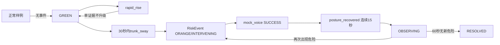

# 7月25日四对象冻结与Mock联调手册

> 版本：Freeze Contract v1.0
> 负责人：张薇
> 适用期限：2026年7月25日至7月31日
> 本次范围：跌倒Mock闭环，不讨论准确率，不接入心理和诈骗场景

## 一、今天会议结束时必须得到什么

1. 五名技术成员确认只使用Observation、Evidence、RiskEvent、InterventionResult四个核心对象；
2. 算法不输出GREEN、YELLOW、ORANGE、RED，最终等级只由RiskEngine产生；
3. 四对象JSON能够被公共Pydantic模型解析；
4. 固定Mock数据能够完成GREEN→ORANGE/INTERVENING→OBSERVING→RESOLVED；
5. 字段缺失、冲突、重复提交和低质量输入有统一处理规则；
6. 五人完成接口确认表，未确认项必须写明原因、负责人和截止时间。

## 二、张薇的会议开场稿

> “今天只做接口冻结，不讨论模型准确率，也不增加功能。7月31日前所有模块必须使用schema_version 1.0。算法只负责Observation和Evidence，智能体的RiskEngine是唯一可以生成风险等级的模块，后端负责校验、保存和传递，前端只展示后端结果。今天确认后，任何人不能私自增加字段、修改枚举或设计第二套风险等级。”

## 三、30分钟会议议程

| 时间 | 主讲/回答人 | 内容 | 必须记录的结论 |
|---|---|---|---|
| 0—3分钟 | 张薇 | 宣布冻结目标与边界 | schema_version=1.0；只有四种风险等级 |
| 3—9分钟 | 赵勇、常易铭 | Observation | 能否生成必填字段；数据质量由谁产生 |
| 9—15分钟 | 赵勇、常易铭、张薇 | Evidence | 算法只输出Evidence；不能携带risk_level/status |
| 15—20分钟 | 张薇、冷雨彤 | RiskEvent | RiskEngine唯一生成；峰值风险与事件状态的含义 |
| 20—24分钟 | 冷雨彤、陈硕 | InterventionResult | SUCCESS/FAILED/RETRYING如何保存和展示 |
| 24—27分钟 | 全体 | 错误与幂等 | 422、409、重复提交、低质量输入规则 |
| 27—30分钟 | 全体 | 固定Mock序列 | 负责人、接口、7月31日验收方式 |

## 四、会议逐人确认问题

### 赵勇

- 是否可以将MediaPipe特征先整理为Observation，再输出统一Evidence？
- 7月31日前是否能补齐`posture_recovered`？
- 是否确认不在算法分支定义risk_level和事件状态？

### 常易铭

- 是否确认现有Evidence校验器不再作为另一份字段来源，统一以`contracts/v1/models.py`为准？
- 行为和语音模块能否使用同一Evidence模型？
- 是否确认低音频质量只生成质量证据，不直接升级风险？

### 冷雨彤

- 能否将公共Pydantic模型接入FastAPI请求校验？
- 能否按422、409和幂等规则实现存储层？
- ToolAdapter能否返回统一InterventionResult？

### 陈硕

- 首页、时间轴、事件详情分别需要四对象中的哪些字段？
- 是否确认`title`、`timeline`、`risk_history`只属于前端ViewModel？
- 是否确认页面不重新计算risk_level，并展示source_mode和simulated？

### 张薇

- 快速起身单证据为什么不升级？
- 哪两类证据在什么窗口内触发ORANGE？
- 工具成功为什么不等于风险已回落？
- 什么条件进入OBSERVING和RESOLVED？

## 五、四对象冻结表

### Observation：算法直接看到了什么

| 字段组 | 固定字段 |
|---|---|
| 身份与时间 | schema_version、observation_id、resident_id、timestamp |
| 直接观测 | source、feature_name、feature_value、unit、location |
| 可信程度 | confidence、data_quality |
| 来源追溯 | source_mode、asset_id、simulated、metadata（可选） |

### Evidence：观测对风险意味着什么

| 字段组 | 固定字段 |
|---|---|
| 身份与追溯 | schema_version、evidence_id、observation_ids、resident_id、timestamp |
| 证据含义 | risk_domain、evidence_type、severity、explanation |
| 可信程度 | confidence、data_quality |
| 基线比较 | baseline_value、current_value、baseline_deviation、time_scale、location |
| 来源与版本 | adapter_version、source_mode、simulated |

Evidence不重复保存`asset_id`。素材追溯固定使用`observation_ids → Observation.asset_id`；无素材时由Observation传递`asset_id=null`。

Evidence禁止出现`risk_level`和`status`。

### RiskEvent：智能体综合形成了什么事件

| 字段组 | 固定字段 |
|---|---|
| 身份与时间 | schema_version、event_id、resident_id、created_at、updated_at |
| 风险结果 | primary_domain、related_domains、risk_level、risk_score、time_horizon |
| 证据链 | evidence_ids、evidence_summary |
| 行动与状态 | recommended_action、intervention_policy、status、ruleset_version |
| 来源 | source_mode、simulated |

`risk_level/risk_score`记录事件触发或峰值风险。事件解除后保留ORANGE，通过`status=RESOLVED`表示已经回落。

### InterventionResult：系统做了什么、是否起作用

| 字段组 | 固定字段 |
|---|---|
| 身份与时间 | schema_version、result_id、event_id、started_at、completed_at |
| 工具执行 | action_type、tool_name、delivery_status、operator |
| 人员反馈 | resident_response、family_feedback |
| 回落结果 | risk_after、resolved、resolution_reason |
| 来源 | source_mode、simulated |

## 六、核心对象与前端ViewModel边界

| 核心契约字段 | 前端可派生但不得写回核心对象 |
|---|---|
| RiskEvent、Evidence、Observation、InterventionResult | title、timeline、risk_history、页面标签、图表点位、按钮状态 |

前端可以组合四对象形成事件详情页，但不得增加风险等级、改变事件状态或使用页面字段作为RiskEngine输入。

## 七、字段错误和冲突处理

| 情况 | 结果 | 是否进入状态机 |
|---|---|---:|
| 缺少必填字段、非法枚举、类型错误、分数越界、时间无时区 | 422 | 否 |
| 未定义字段 | 422 | 否 |
| observation_ids不存在 | 409 | 否 |
| Evidence与Observation的resident/source/simulated冲突 | 409 | 否 |
| 相同ID、相同内容重复提交 | 幂等成功，返回原对象 | 不重复执行 |
| 相同ID、不同内容 | 409 | 否 |
| data_quality<0.70 | 保存并记录质量问题 | 不自动升级ORANGE |

允许为空的字段必须传`null`，不能用0或空字符串冒充未知值。

## 八、7月31日固定Mock数据

统一身份和来源：

```text
resident_id=resident-mock-001
schema_version=1.0
source_mode=MOCK
simulated=true
ruleset_version=ruleset-v1.0
```

| 序号 | Observation | Evidence | 工程值 |
|---|---|---|---|
| 1 | 正常起身3.4秒 | normal_baseline_sample | 基线3.5秒 |
| 2 | 快速起身1.2秒 | rapid_rise | confidence=0.92，quality=0.88 |
| 3 | 躯干摇晃18度 | trunk_sway | 基线5度，confidence=0.90，quality=0.88 |
| 4 | 连续稳定15秒 | posture_recovered | confidence=0.94，quality=0.90 |

固定工程门槛：质量0.70、普通置信度0.70、高置信度0.80、组合30秒、稳定15秒、观察60秒。只用于Mock联调，不作为实验结论。

## 九、固定联调流程



| 步骤 | 预期对象 | 预期结果 |
|---|---|---|
| 正常输入 | Observation＋Evidence | GREEN，不创建核心RiskEvent |
| rapid_rise | Observation＋Evidence | 暂存候选，不创建RiskEvent |
| trunk_sway | RiskEvent | event-mock-fall-001，ORANGE/INTERVENING，score=0.82 |
| mock_voice | InterventionResult | SUCCESS，resolved=false，重复请求不重复播放 |
| posture_recovered | Evidence＋RiskEvent | OBSERVING |
| 虚拟推进61秒 | RiskEvent＋InterventionResult | RESOLVED，risk_after=0.24 |

## 十、接口负责人

| 接口 | 实现人 | 规则/验收人 | 消费或协作人 |
|---|---|---|---|
| POST /api/v1/observations | 冷雨彤 | 张薇 | 赵勇、常易铭 |
| POST /api/v1/evidence | 冷雨彤 | 张薇 | 赵勇、常易铭 |
| POST /api/v1/risk/evaluate | 张薇 | 冷雨彤 | 陈硕 |
| GET /api/v1/events/{event_id} | 冷雨彤 | 张薇 | 陈硕 |
| POST /api/v1/events/{event_id}/intervene | 冷雨彤、张薇 | 陈硕 | ToolAdapter |
| POST /api/v1/events/{event_id}/results | 冷雨彤 | 张薇、陈硕 | ToolAdapter/家属反馈 |

## 十一、字段修改流程

7月31日前默认不修改v1.0。确需修改时，申请必须包含：

1. 修改原因和不能通过现有字段解决的证据；
2. 修改前后JSON；
3. 对算法、智能体、后端、数据库、前端和测试的影响；
4. 兼容或降级方案；
5. 张薇与冷雨彤共同批准记录。

批准后必须在同一个PR中更新模型、Schema、样例、测试、冻结规范和决策日志。未完成同步不得合并。

## 十二、五人确认表

| 成员 | 确认事项 | 结论 | 问题/修改申请 | 截止时间 | 本人确认 |
|---|---|---|---|---|---|
| 张薇 | RiskEngine进入、干预、观察和回落规则 | 待本人确认 |  | 7月25日 |  |
| 冷雨彤 | Pydantic、422/409、幂等、存储和ToolAdapter | 待本人确认 |  | 7月25日 |  |
| 赵勇 | rapid_rise、trunk_sway、posture_recovered输出 | 待本人确认 | 当前分支缺posture_recovered | 7月26日 |  |
| 常易铭 | 共用Evidence契约，不维护第二套字段 | 待本人确认 |  | 7月25日 |  |
| 陈硕 | 页面消费字段和ViewModel边界 | 待本人确认 | 前端现有Mock需按核心契约核对 | 7月26日 |  |

不得代替成员填写“已确认”。会后由张薇将成员原话或确认截图链接填入最后一列。

## 十三、运行和验收命令

```powershell
python scripts/export_contract_schemas.py
python -m unittest discover -s tests -v
python scripts/run_mock_sequence.py --runs 3
```

预期：

- 导出4份Schema和6份JSON样例（含跨端共用`four_objects.json`）；
- 自动测试全部通过；
- 完整闭环连续3次结果一致；
- 每轮`mock_voice`真实调用计数为1，幂等重放不重复执行；
- 运行日志保存到`artifacts/7月25日Mock联调运行日志.json`。

## 十四、当前机器验收记录

| 项目 | 结果 |
|---|---|
| 四对象Pydantic解析 | 已通过 |
| JSON Schema导出 | 已通过，4份 |
| 固定JSON样例 | 已生成，6份 |
| 自动测试 | 已通过，22项 |
| 三轮固定闭环 | 已通过，三轮结果一致 |
| 工具幂等 | 已通过，每轮只执行1次 |
| 人员确认 | 待30分钟接口会后填写 |
