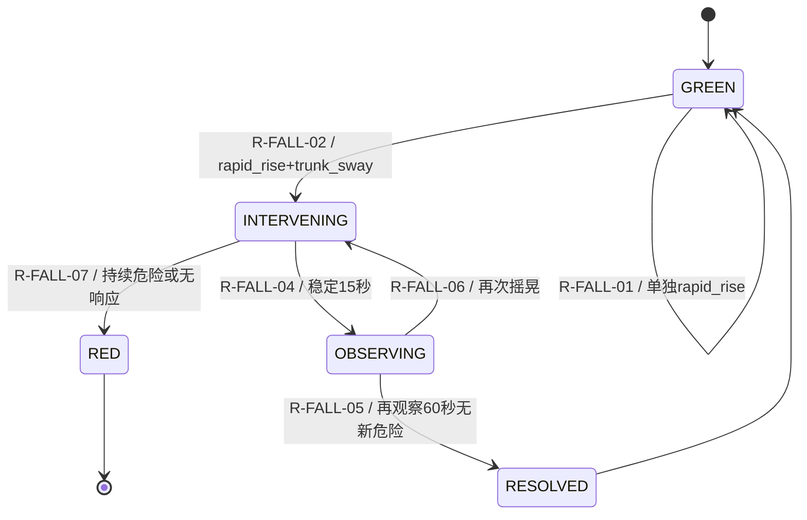

# 三层记忆与 ruleset-v1.0

本文件把“个人记忆”和“风险判断”落实为一期可执行的 Python 内存实现。它不改变四对象契约；`MemorySnapshot`、`RuleTrace` 和基线决策记录属于智能体内部对象，不作为 `Observation`、`Evidence`、`RiskEvent` 或 `InterventionResult` 的扩展字段。

## 1. 三层记忆

| 层级 | 窗口 | 保存内容 | 决策用途 |
|---|---:|---|---|
| 短时 | 最近30秒 | rapid_rise、trunk_sway、low_light、posture_recovered、再次失衡 | 判断当前是否存在临近危险、是否需要再次干预 |
| 中时 | 最近24小时 | 异常起身次数、起夜、低照度、活动状态、当前YELLOW状态 | 提供当天上下文，修正即时风险解释 |
| 长时 | 滚动7天以上 | 起身时长、摇摆幅度、步态稳定性、活动范围、作息样本 | 与张爷爷自己的基线比较，识别持续偏离 |

一期使用 `MemoryStore` 按 `resident_id + timestamp` 保存并查询结构化对象，不建设向量数据库。7天历史使用明确标注 `source_mode=MOCK`、`simulated=true` 的安全样例，不能表述为真实老人长期试验。

## 2. 个人基线和污染防护

每项可量化特征采用滚动中位数（median）和 MAD（median absolute deviation）。基线状态按有样本的不同日期计算：少于3天为 `INSUFFICIENT`，3—6天为 `PROVISIONAL`，不少于7天为 `STABLE`。

只有同时满足以下条件的样本才进入基线：当前状态为 `GREEN`、`confidence >= 0.70`、`data_quality >= 0.70`、关联Observation没有遮挡或 tracking lost 等质量标记、Evidence属于安全基线样本且包含可映射的数值特征。

`YELLOW`、`ORANGE`、`RED` 状态，低质量或质量异常样本，以及 `rapid_rise`、`trunk_sway`、`gait_instability`、`persistent_instability`、`no_response` 等危险证据均不更新正常基线。模拟安全历史可以用于接口和规则测试，不能替代实测结论。

## 3. ruleset-v1.0 工程初值

完整配置位于 [`contracts/v1/rulesets/ruleset-v1.0.json`](../contracts/v1/rulesets/ruleset-v1.0.json)。当前初值仅服务于7月31日Mock联调，后续应依据研究生建议和验证集校准：

| 参数 | 初值 |
|---|---:|
| 短时组合窗口 | 30秒 |
| 普通/高置信度门槛 | 0.70 / 0.80 |
| 数据质量门槛 | 0.70 |
| 稳定姿态 | 连续15秒 |
| 回落观察期 | 60秒 |
| severity / confidence / quality / context 权重 | 0.45 / 0.30 / 0.15 / 0.10 |

综合风险分为：`0.45×最大severity + 0.30×最大confidence + 0.15×最小data_quality + 0.10×context_score`，结果限制在0—1。固定跌倒Mock的夜间上下文使风险分为0.82；这不是实验准确率或医学结论。

## 4. 规则表

| 规则 | 输入与条件 | 状态变化和动作 |
|---|---|---|
| R-FALL-01 | 仅有 rapid_rise | 保持GREEN，等待独立组合证据 |
| R-FALL-02 | 30秒内 rapid_rise + trunk_sway，质量合格且至少一项高置信 | 创建ORANGE RiskEvent，进入INTERVENING |
| R-FALL-03 | `data_quality < 0.70` 或质量门控失败 | 生成SYSTEM/quality_gate_failed，不升级风险 |
| R-FALL-04 | posture_recovered 连续稳定至少15秒 | INTERVENING → OBSERVING |
| R-FALL-05 | OBSERVING持续60秒且无新危险 | OBSERVING → RESOLVED，结果 `risk_after=0.24` |
| R-FALL-06 | OBSERVING期间再次出现 trunk_sway 等危险 | OBSERVING → INTERVENING，再次干预 |
| R-FALL-07 | persistent_instability、no_response或重复干预后仍危险 | ORANGE → RED/ESCALATED，通知家属人工接管 |
| R-SYSTEM-01 | 相同Evidence ID和内容重复提交 | 幂等返回，不重复创建事件或播放工具 |

每次引擎判断都生成 `RuleTrace`，记录短/中/长查询窗口、命中规则、前后状态、事件ID、未命中原因和规则版本，便于从页面回溯到证据。

## 5. 状态转移



绿色是引擎当前水位，不创建空的 `RiskEvent`；事件回落后仍保留原 `risk_level=ORANGE`，以 `status=RESOLVED` 和 `InterventionResult.risk_after` 表达结果。

## 6. 固定Mock决策回放

| 步骤 | 证据 | 查询窗口 | 命中规则 | 状态/结果 | 未命中原因 |
|---|---|---|---|---|---|
| 1 | normal_baseline_sample | 中、长时 | 无升级 | GREEN，无事件 | 没有临近危险组合 |
| 2 | rapid_rise | 短时30秒 | R-FALL-01 | GREEN | 缺少trunk_sway |
| 3 | trunk_sway | 短时30秒 | R-FALL-02 | ORANGE/INTERVENING | 组合窗口内且质量合格 |
| 4 | mock_voice | 当前事件 | 工具调用 | 干预成功 | 不重复播放 |
| 5 | posture_recovered | 短时30秒 | R-FALL-04 | OBSERVING | 15秒稳定但尚未观察完成 |
| 6 | 虚拟推进61秒 | 短、中、长 | R-FALL-05 | RESOLVED | 无新危险证据 |

可运行脚本：

```powershell
python scripts/run_memory_ruleset_rehearsal.py --runs 3
```

日志输出到 `artifacts/7月26日记忆与规则验收日志.json`，所有输入均明确为模拟数据。
